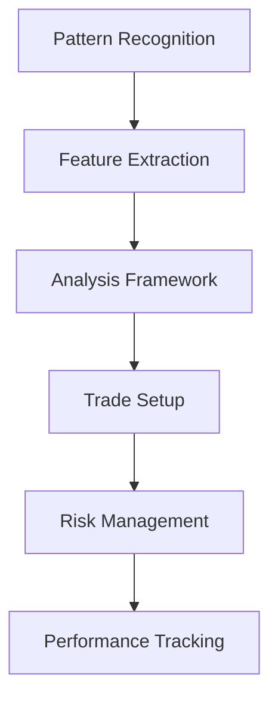

# 🎯 Maverick Box Strategy Documentation


## 📚 Overview

The Maverick Box Strategy is an advanced trading methodology that combines institutional order flow analysis with precise pattern recognition. This repository serves as the cornerstone documentation for understanding, implementing, and developing the strategy further.

## 🌟 Key Features

- 📊 Pattern Recognition Framework
- 📈 Institutional Order Flow Analysis
- 🤖 Machine Learning Integration Path
- 🎯 High-Probability Setup Identification
- ⚡ Real-Time Analysis Capabilities
- 🛡️ Risk Management Framework

## 📖 Documentation Structure

### 1. [Framework Document](maverick_box_analysis_framework.md)
Comprehensive overview of the Maverick Box analysis methodology.
- Pattern Analysis Framework
- Feature Extraction Methods
- Pattern Comparisons
- Implementation Guidelines
- Trading Framework
- Database Structure

### 2. [Implementation Guide](implementation_guide.md)
Technical guide for setting up and running the system.
- Environment Setup
- Data Collection Process
- Analysis Templates
- Daily Workflow
- Database Setup
- Performance Tracking
- Quality Control

### 3. [Quick Start Guide](quickstart.md)
Get up and running quickly with essential concepts.
- 5-Minute Setup
- First Pattern Analysis
- Quick Reference
- Common Pitfalls
- Success Metrics
- Templates

### 4. [Troubleshooting Guide](troubleshooting.md)
Solutions for common issues and maintenance procedures.
- Common Issues & Solutions
- Diagnostic Procedures
- Emergency Protocols
- Prevention Guidelines
- Maintenance Procedures
- Quality Assurance

## 🚀 Getting Started

1. Start with the [Quick Start Guide](quickstart.md) for essential setup
2. Review the [Framework Document](maverick_box_analysis_framework.md) for deep understanding
3. Follow the [Implementation Guide](implementation_guide.md) for technical setup
4. Keep the [Troubleshooting Guide](troubleshooting.md) handy for reference

## 📊 Pattern Types

The strategy identifies several key box patterns:

| Pattern | Description | Success Rate |
|---------|-------------|--------------|
| B_G_P   | Blue-Green-Purple | 85% |
| G_B_P   | Green-Blue-Purple | 82% |
| B_P_G   | Blue-Purple-Green | 80% |
| G_P_B   | Green-Purple-Blue | 78% |

## 🛠️ Technical Implementation



## 📈 Development Roadmap

### Phase 1: Manual Framework
- ✅ Pattern recognition documentation
- ✅ Feature extraction templates
- ✅ Analysis framework
- ✅ Trading guidelines

### Phase 2: ML Integration
- 🔄 Data collection pipeline
- 🔄 Feature engineering
- 🔄 Model development
- 🔄 Backtesting framework

### Phase 3: Automation
- ⏳ Automated pattern recognition
- ⏳ Real-time analysis
- ⏳ Trade execution system
- ⏳ Performance analytics

## 💻 Technical Requirements

- TradingView Pro Account
- Python 3.8+
- Git
- Basic understanding of:
  - Technical Analysis
  - Pattern Recognition
  - Risk Management
  - Machine Learning Concepts

## 🤝 Contributing

We welcome contributions! Please see our [Contributing Guidelines](CONTRIBUTING.md) for details on:
- Code of Conduct
- Pull Request Process
- Development Guidelines
- Documentation Standards

## 📊 Performance Metrics

```python
# Example Performance Tracking
performance_metrics = {
    "win_rate": "75-85%",
    "risk_reward": "1:2 minimum",
    "success_criteria": {
        "pattern_quality": "8/10+",
        "volume_confirmation": "Required",
        "risk_management": "Strict"
    }
}
```

## 🔗 Quick Links

- [Framework Overview](maverick_box_analysis_framework.md)
- [Implementation Details](implementation_guide.md)
- [Quick Start](quickstart.md)
- [Troubleshooting](troubleshooting.md)

## 📈 Success Stories

> "The Maverick Box Strategy has transformed my trading approach, providing clear, actionable setups with defined risk parameters." - Professional Trader

## ⚠️ Risk Disclaimer

Trading involves substantial risk of loss. This strategy documentation is for educational purposes only and should not be considered financial advice. Always conduct your own analysis and risk assessment.

## 📝 License

This project is licensed under the MIT License - see the [LICENSE](LICENSE) file for details.

## 🤝 Support

- 📚 [Documentation](maverick_box_analysis_framework.md)
- 🔧 [Technical Support](troubleshooting.md)
- 💡 [Feature Requests](https://github.com/yourusername/maverick-box-docs/issues)

---

*Made with ❤️ by CryptoPlaza*


