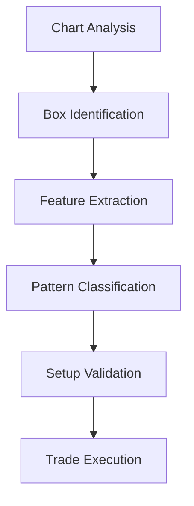

# 🎯 Maverick Box Pattern Analysis Framework

## 📊 Overview

This document outlines a comprehensive framework for analyzing Maverick Box patterns using vision-based pattern recognition and feature extraction. The framework provides a structured approach to identifying, analyzing, and trading box formations with high probability setups.

## 🔍 Pattern Analysis Framework

### Core Components

1. **Geometric Analysis**
   - Box height relationships
   - Inter-box spacing
   - Width consistency
   - Position metrics

2. **Price Action Analysis**
   - Containment percentages
   - Momentum patterns
   - Breakout characteristics
   - Support/resistance interactions

3. **Volume Profile**
   - Formation characteristics
   - Institutional footprint
   - Volume transitions
   - Smart money positioning

## 📈 Pattern Comparisons

### B_G_P Pattern (Blue-Green-Purple)

#### Geometric Features
- **Box Heights**
  * Blue: 100-120 pips
  * Green: 130-150 pips
  * Purple: 80-100 pips
- **Spacing**
  * B→G: 20-30 pips
  * G→P: 50-70 pips

#### Price Action
- **Containment**
  * Blue: 90%+
  * Green: 80-85%
  * Purple: 95%+
- **Momentum**
  * Decreasing volatility
  * Clear compression
  * Clean transitions

#### Volume Profile
- **Characteristics**
  * Distribution → Transition → Accumulation
  * Professional positioning
  * Retail exhaustion

#### Reliability Score: 85/100

### G_B_P Pattern (Green-Blue-Purple)

#### Geometric Features
- **Box Heights**
  * Green: 150-170 pips
  * Blue: 120-140 pips
  * Purple: 90-110 pips
- **Spacing**
  * G→B: 40-50 pips
  * B→P: 15-25 pips

#### Price Action
- **Containment**
  * Green: 75-80%
  * Blue: 85-90%
  * Purple: 95%+
- **Momentum**
  * Increasing compression
  * Strong final momentum
  * Clean transitions

#### Volume Profile
- **Characteristics**
  * Distribution → Transition → Accumulation
  * Clear institutional patterns
  * Smart money accumulation

#### Reliability Score: 82/100

## 🛠️ Implementation Guide

### 1. Pattern Recognition Process



### 2. Feature Extraction Template

```json
{
    "pattern_id": "BOX_SEQUENCE",
    "geometric_features": {
        "box_heights": [],
        "spacing_metrics": [],
        "width_analysis": []
    },
    "price_action": {
        "containment": [],
        "momentum": [],
        "breakouts": []
    },
    "volume_profile": {
        "formation": [],
        "transitions": [],
        "footprint": []
    }
}
```

### 3. Trading Framework

#### Entry Rules
- Primary entry: Box breakout
- Secondary entry: Mid-point retest
- Confirmation: Volume + Price action

#### Risk Management
- Stop Loss: Below box low
- Position Size: Based on pattern tier
- Risk per Trade: 1-2% maximum

#### Target Methodology
1. T1: 1.5x box height
2. T2: 2.5x box height
3. T3: 3.5x box height

## 📊 Pattern Database Structure

### Data Collection
```sql
CREATE TABLE pattern_data (
    id INTEGER PRIMARY KEY,
    pattern_type TEXT,
    geometric_features JSON,
    price_action JSON,
    volume_profile JSON,
    reliability_score INTEGER,
    outcome TEXT
);
```

### Feature Storage
- Standardized JSON format
- Normalized metrics
- Time-stamped entries
- Outcome tracking

## 🔄 Workflow Integration

### 1. Analysis Process
1. Chart preparation
2. Pattern identification
3. Feature extraction
4. Setup validation
5. Trade planning

### 2. Documentation Requirements
- Pattern screenshots
- Feature measurements
- Setup rationale
- Risk parameters

### 3. Performance Tracking
- Pattern success rates
- Setup reliability
- Risk/reward metrics
- Win rate analysis

## 🚀 Future Development

### Machine Learning Integration
1. Feature database expansion
2. Pattern classification models
3. Automated recognition
4. Real-time alerts

### Framework Enhancement
1. Pattern variation analysis
2. Market context integration
3. Advanced risk models
4. Performance optimization

## 📝 Best Practices

### Pattern Analysis
- Use consistent timeframes
- Verify volume profiles
- Confirm institutional activity
- Document all setups

### Trade Management
- Follow position sizing rules
- Use defined stop losses
- Scale out at targets
- Track all outcomes

### Risk Control
- Maximum risk per trade
- Pattern reliability minimum
- Clear invalidation points
- Position correlation limits

## 🔍 Quality Assurance

### Validation Checklist
- [ ] Pattern matches criteria
- [ ] Volume confirms setup
- [ ] Risk parameters defined
- [ ] Targets identified
- [ ] Stop loss placed
- [ ] Position size calculated

### Review Process
1. Daily pattern review
2. Weekly performance analysis
3. Monthly framework updates
4. Quarterly strategy review

## 📈 Performance Metrics

### Key Indicators
- Win rate
- Risk/reward ratio
- Average return
- Maximum drawdown

### Pattern Statistics
- Success by type
- Failure analysis
- Setup quality
- Market correlation

## 🎓 Educational Resources

### Required Reading
1. Pattern recognition basics
2. Volume profile analysis
3. Risk management principles
4. Institutional trading

### Skill Development
- Chart analysis
- Pattern identification
- Risk calculation
- Trade management

## ⚠️ Risk Disclaimer

Trading involves substantial risk of loss. This framework is for educational purposes only and should not be considered financial advice. Always conduct your own analysis and risk assessment before trading.

---

*This framework is continuously evolving based on market feedback and performance analysis. Regular updates will be made to improve accuracy and effectiveness.*
